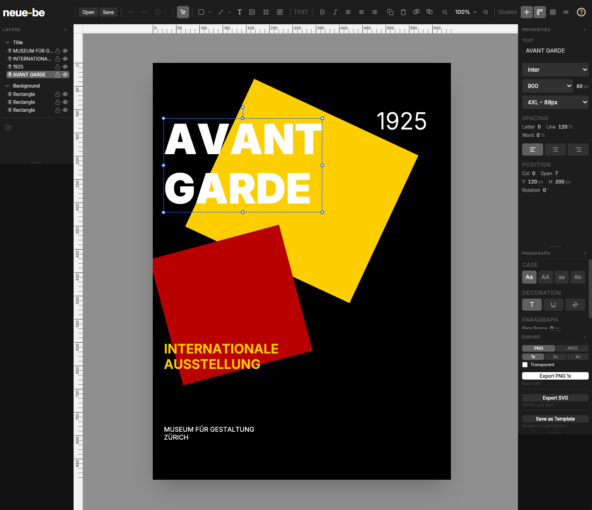

# neue-be

A free poster design tool that enforces Swiss design principles.

**[Use it now at neue-be.com](https://neue-be.com)**

---

## What is this?

neue-be is a browser-based vector editor for creating posters, covers, and graphic designs. It encodes the rules of Swiss/International Typographic Style into the tool itself—grid systems, typography scales, and color constraints that guide you toward better design without requiring a design degree.

### Key principles

- **Free forever** — No paid tiers, no features behind paywalls
- **No account required** — No email, no password, no tracking
- **Local-first** — Your files stay on your device. Nothing uploads to any server.
- **Constraint-based** — The grid does the thinking. You make the decisions.

---

## Features

### Design System
- 12-column modular grid with snap alignment
- Curated typography scales (not arbitrary font sizes)
- Constrained color palettes based on Swiss design heritage
- Swiss Modern preset enforcing design rules

### Drawing Tools
- Rectangle, circle, triangle, polygon primitives
- Line tool
- Star, gear, badge, arrow, arc, ring, cross generators
- Direct manipulation with transform handles

### Editing
- Multi-select with Shift+click
- Resize with aspect ratio lock (Shift) and center-resize (Alt)
- Rotation with 15° snapping
- Grid column snapping
- Keyboard shortcuts for common operations

### Export
- PNG at 1x, 2x, 4x resolution
- SVG vector export
- JSON project files (save/open locally)

---

## Tech Stack

| Layer | Technology |
|-------|------------|
| Framework | React 19 |
| Language | TypeScript 5.9 (strict mode) |
| Rendering | HTML5 Canvas API |
| Styling | Tailwind CSS 4 |
| Build | Vite 7 |
| State | React Context + useReducer |
| Storage | localStorage (auto-save) |
| Hosting | Cloudflare Pages |

---

## Getting Started

### Use it online

Just go to **[neue-be.com](https://neue-be.com)**. No installation required.

---

## Keyboard Shortcuts

| Action | Shortcut |
|--------|----------|
| Select tool | V |
| Rectangle | R |
| Circle | O |
| Text | T |
| Delete selected | Delete / Backspace |
| Deselect | Escape |
| Constrain proportions | Hold Shift |
| Resize from center | Hold Alt |
| Snap rotation to 15° | Hold Shift |

---

## Roadmap

### In Progress
- [ ] Gradients - linear, radial, angular
- [ ] Expanded canvas size presets
- [ ] More Swiss color palettes

### Planned
- [ ] Additional parametric shape generators
- [ ] Template library expansion
- [ ] PDF export

### Maybe Later
- [ ] Collaborative editing (would require accounts)
- [ ] Plugin system
- [ ] Mobile support

See [Issues](https://github.com/b00gn1sh/neue-be/issues) for feature requests and bug reports.

---

## Why "neue-be"?

"Neue" is German for "new"—a nod to Neue Haas Grotesk (the original name for Helvetica) and the Swiss design heritage this tool builds on.

---

## Contributing

Contributions welcome! Please:

1. Check existing issues before opening a new one
2. For features, open an issue first to discuss
3. For bugs, include steps to reproduce
4. Keep PRs focused on a single change

See [CONTRIBUTING.md](./CONTRIBUTING.md) for details.

---

## Acknowledgments

Inspired by the work of Josef Muller-Brockmann, Armin Hofmann, Karl Gerstner, and the Swiss design pioneers who proved that constraints create better design.
